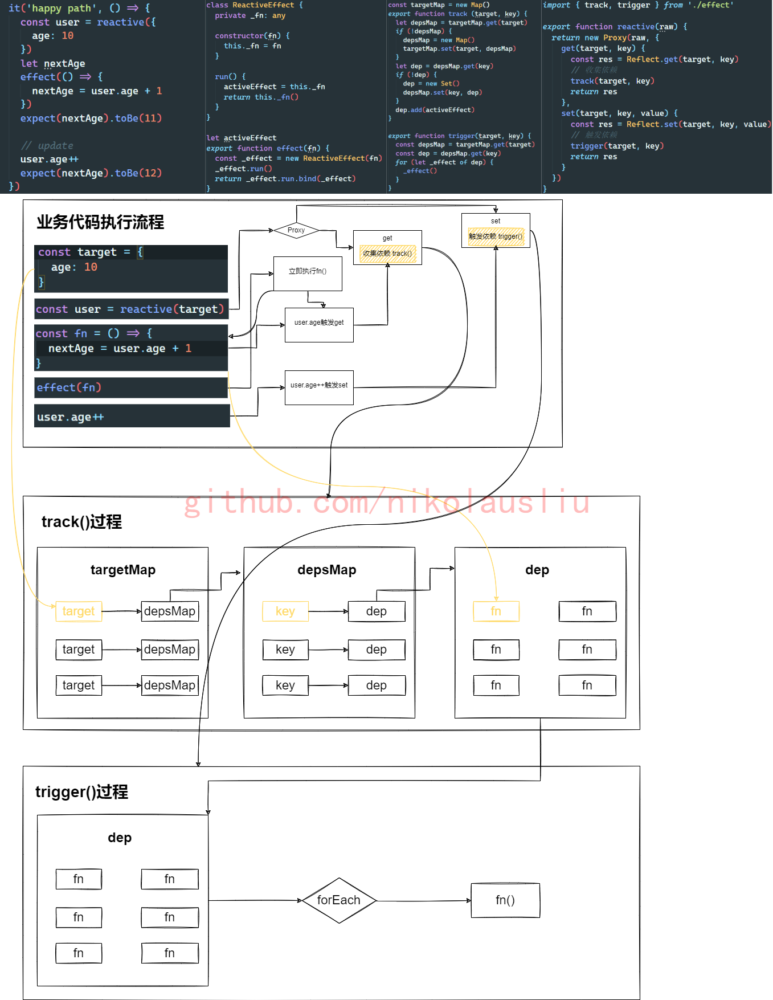

- [手撕mini-vue系列文章代码仓库](https://github.com/mini-vue)
- 本节代码对应分支：effect-reactive-track-trigger

这是我学习mini-vue源码的第2篇博文：**手撕mini-vue源码——实现effect & reactive & track & trigger**

本节任务清单：

- [x] 编写reactive测试用例。
- [x] 实现reactive函数，跑通reactive测试用例。
- [x] 编写effect测试用例。
- [x] 实现effect函数，依赖收集track函数，依赖触发trigger函数，深入理解依赖收集和依赖触发的过程。
- [x] 跑通effect测试用例。

# 编写 reactive 测试用例

首先我们把上一节`index.spec.ts`和`index.ts`文件删除，现在已经不需要了。

新建`reactive.spec.ts`文件，编写如下测试代码：

```ts
import { reactive } from '../reactive'

describe('reactive', () => {
  it('happy path', () => {
    const original = { foo: 1}
    const observed = reactive(original)
    expect(original).not.toBe(observed)
    expect(observed.foo).toBe(1)
  })
})
```

此时我们执行`yarn test reactive`肯定是跑不通测试的，因为我们还没有实现reactive函数的代码。

# 实现 reactive

新建`reactive.ts`，编写如下代码：

```ts
export function reactive(raw) {
  return new Proxy(raw, {
    get(target, key) {
      const res = Reflect.get(target, key)
      // TODO:收集依赖
      return res
    },
    set(target, key, value) {
      const res = Reflect.set(target, key, value)
      // TODO:触发依赖
      return res
    }
  })
}
```

这段代码就是把传入的对象参数，使用Proxy进行了一层代理，在get操作里收集依赖，在set操作里触发依赖，这是响应式得以实现的核心。收集依赖和触发依赖的代码，我们待会再实现。

同时需要在`tsconfig.json`里加入这条配置`"lib": ["DOM", "ES6"]`以消除Proxy的ts报错。

此时，运行命令`yarn test reactive`发现reactive单测已经可以跑通了。

# 编写 effect 测试用例

新建`effect.spec.ts`，编写如下代码：

```ts
import { reactive } from '../reactive'
import { effect } from '../effect'

describe('effect', () => {
  it('happy path', () => {
    const user = reactive({
      age: 10
    })
    let nextAge
    effect(() => {
      nextAge = user.age + 1
    })
    expect(nextAge).toBe(11)

    // update
    user.age++
    expect(nextAge).toBe(12)
  })
})
```

这里的响应式过程是：

- 先定义了一个响应式的对象user，传入effect的回调函数fn会立即执行一次。
- 当代码执行到user.age这里的时候触发了user响应式对象的get，触发了收集依赖，此时会把fn作为依赖收集起来。
- 当代码执行到user.age++的时候触发了user响应式对象的set，出发了触发依赖，此时会把上一步收集到的依赖fn调用一遍，因此与响应式数据user相关的nextAge也会得到变更。

# 实现effect & track & trigger

新建`effect.ts`

```ts
const targetMap = new Map()
export function track (target, key) {
  let depsMap = targetMap.get(target)
  if (!depsMap) {
    depsMap = new Map()
    targetMap.set(target, depsMap)
  }
  let dep = depsMap.get(key)
  if (!dep) {
    dep = new Set()
    depsMap.set(key, dep)
  }
  dep.add(activeEffect)
}

export function trigger(target, key) {
  const depsMap = targetMap.get(target)
  const dep = depsMap.get(key)
  for (let _effect of dep) {
    _effect()
  }
}

class ReactiveEffect {
  private _fn: any

  constructor(fn) {
    this._fn = fn
  }

  run() {
    activeEffect = this._fn
    this._fn()
  }
}

let activeEffect
export function effect(fn) {
  const _effect = new ReactiveEffect(fn)
  _effect.run()
}
```

最后再把 reactive.ts 里的`track()`和`trigger()`补齐

```ts
import { track, trigger } from './effect'

export function reactive(raw) {
  return new Proxy(raw, {
    get(target, key) {
      const res = Reflect.get(target, key)
      // 收集依赖
      track(target, key)
      return res
    },
    set(target, key, value) {
      const res = Reflect.set(target, key, value)
      // 触发依赖
      trigger(target, key)
      return res
    }
  })
}
```

此时运行命令`yarn test`发现两个命令都跑通了。

在写这篇博文的时候我发现我很难用文字把这个过程描述的很清楚，于是我用[drawio](https://app.diagrams.net/)绘制了一张流程图，我终于明白了什么叫一图胜千言。

另外，强烈推荐下drawio这个绘图工具，它是开源的，并且支持多种存储方式，可以本地存储，也可以存储在github仓库中，你每次保存都是一个commit。另外好像还支持源码包的本地部署和二次开发，这个点先占个坑，以后有时间研究研究。

