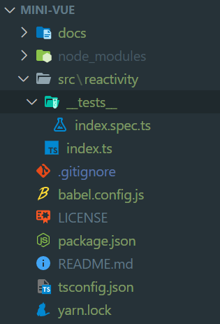
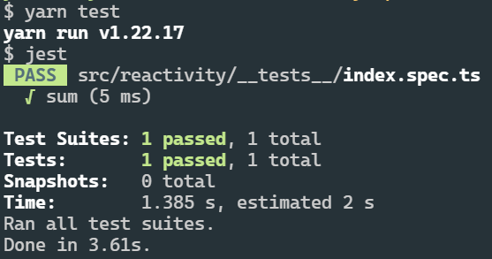

- [手撕mini-vue系列文章代码仓库](https://github.com/mini-vue)
- 本节代码对应分支：env-setup

这是我学习mini-vue源码的第一篇博文：**手撕mini-vue源码——环境搭建**

由于项目源码使用ts编写，同时我们基于测试驱动开发的思想需要用到jest，所以本节的环境搭建主要就是搭建ts和jest相关环境。

本节任务清单：

- [x] 搭建ts环境
- [x] 搭建jest环境
- [x] 编写一个初始的测试用例代码，目的是为了证明我们的环境没问题
- [x] 编写测试用例依赖的函数代码
- [x] 跑通测试用例


# 项目初始化

```sh
yarn init -y
```

先来看看这一节最终的目录结构：



# TypeScript环境搭建

```sh
yarn add typescript --dev
npx tsc --init
```
最后一行命令会生成`tsconfig.json`，这个文件我们做下面两处修改，分别用来支持jest类型以及关闭ts的any校验，因为我们的初衷是为了学原理，有时可能会临时写一些any，这个时候类型不是那么重要。

```json
"types": ["jest"], 
"noImplicitAny": false,
```

# jest环境搭建

```sh
yarn add --dev jest @types/jest 
yarn add --dev babel-jest @babel/core @babel/preset-env 
yarn add --dev @babel/preset-typescript
```
第一行依赖是jest源码和其ts类型。第二行babel相关是为了使原本只支持CommonJs规范的jest代码可以使用ESModule规范用`import`来导入代码。要同时使用babel和ts还需要第三行的依赖。这些在[jest官网](https://jestjs.io/)里都有。

新建`babel.config.js`

```js
module.exports = {
  presets: [
    ['@babel/preset-env', {targets: {node: 'current'}}],
    '@babel/preset-typescript',
  ],
}
```

然后我们在package.json中新增一条test命令：

```json
"scripts": {
  "test": "jest"
},
```

# 运行单测

新建`src/reactivity/index.ts`和`src/reactivity/__tests__/index.spec.ts`，分别键入以下代码：

```ts
// index.spec.ts
import { sum } from '../index'

it('sum', () => {
  expect(sum(1, 1)).toBe(2)
})
```

```ts
// index.ts
export function sum(a, b) {
  return a + b
}
```

运行测试命令`yarn test`




